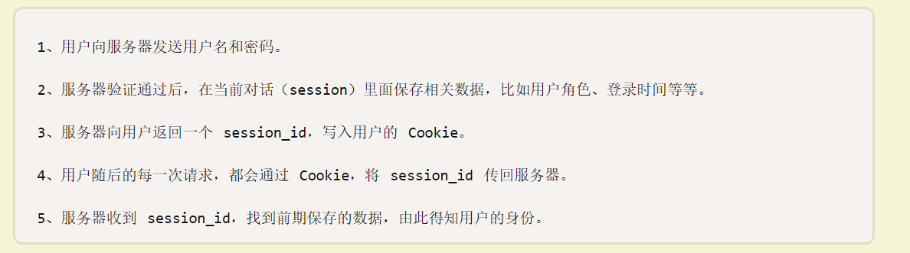

# token
    翻译过来是 令牌 的意思
// 这里简单模拟了下 
面试官：jwt是什么，为什么要用这个https://ruanyifeng.com/blog/2018/07/json_web_token-tutorial.html
目前最流行的跨域认证解决方案，重点在认证，而非跨域

session_id 就是token令牌
前端不应该操作cookie，后端返回体多加点手段就可以让浏览器将令牌写入cookie中
- cookies时浏览器的内存空间，但是瘦后端的掌控，后端将登录令牌保存在cookies中，所有被保存在cookies中数据，都会在http请求时被携带在请求头中
后端如何知道你是否登录，所有的请求都会自动带上一个cookies,cookie会有token令牌，所以请求体一定会有token，后端拿到了这个token，就会去校验是否合法，也就是是否是当初我给你的令牌，如果是，请求首页的数据就发给前端，不合法，首页的数据就不会返回给你了，会给你返回一个报错，比如416状态码，前端就会自己重定向到登录页面
假设在另一个手机也去登录，也会有个新的token，新旧不一样，里面会有个时间戳，后端只去负责最新的token，原手机再去访问个人详情页，这个token就被带去后端，这个token是旧的，不合法了，这个时候后端就会返回一个登录失效
面试官：账号密码在别处修改了，被顶到了怎么办
这里有两个情况，
第一个是原手机还在看个人信息，有一个websocket，实时通知
还有一个是已经在首页，另一个手机还是登录，原手机不能动了，呆在个人信息页可以，但是去其他页面会失效
token可能会被设置周期，所以会过期，过期后依旧让你重新登录，和被别人登录一个道理
登录接口是不携带token的，token存在了cookie中的话，修改密码再次登录，token依旧会被带过去，后端眼里，除了登录接口，他是不会去看token的
token就是一个json的格式，里面是你的用户名等信息，就是一个明文传输，很不安全，所以要进行加密，后端最后的token返回给你的格式是16进制的，存到cookie，如果后端不给你存到cookie呢，直接给到前端，这个时候就需要前端自己存储，后端可以控制cookie的，但是前端三个东西都可以控制，有些人存在session，会话存储就代表，关闭消失，每次都需要重新登录，比如后台管理系统，如果存在cookie中，可以设置周期，sessionStorage就要你重新登录，前端自己控制存在哪里，可以问产品经理，是否缓存登录记录

接下来自己控制存在哪里
- token加密后有三部分组成，头部，负载，签名
一个jwt token就应该有这些东西，不这么干，有些情形就实现不了
前端登录成功，后端就需要把这个token返回过去，否则就是写额外的代码让token写入到前端的cookie中取
接下来就是后端如何打造一个token
还要给他加密 算法安装别人的就可以npm i jsonwebtoken
为什么写项目需要封装axios
面试官：项目中token校验怎么干的
 前端登录后，后端校验账号密码，成功后会靠jwt生成一个token，并将该token返回给前端，前端接受到token后，将token存储在浏览器本地缓存，封装了axios，在请求拦截中，为每一次请求头中添加一个authorization字段，之后的接口请求后端获取到请求头中的token并进行校验，如果token合法，则返回数据，否则返回401，告诉前端token失效
 追问：几种缓存机制的区别，localStorage,session，cookie
 追问：http状态码